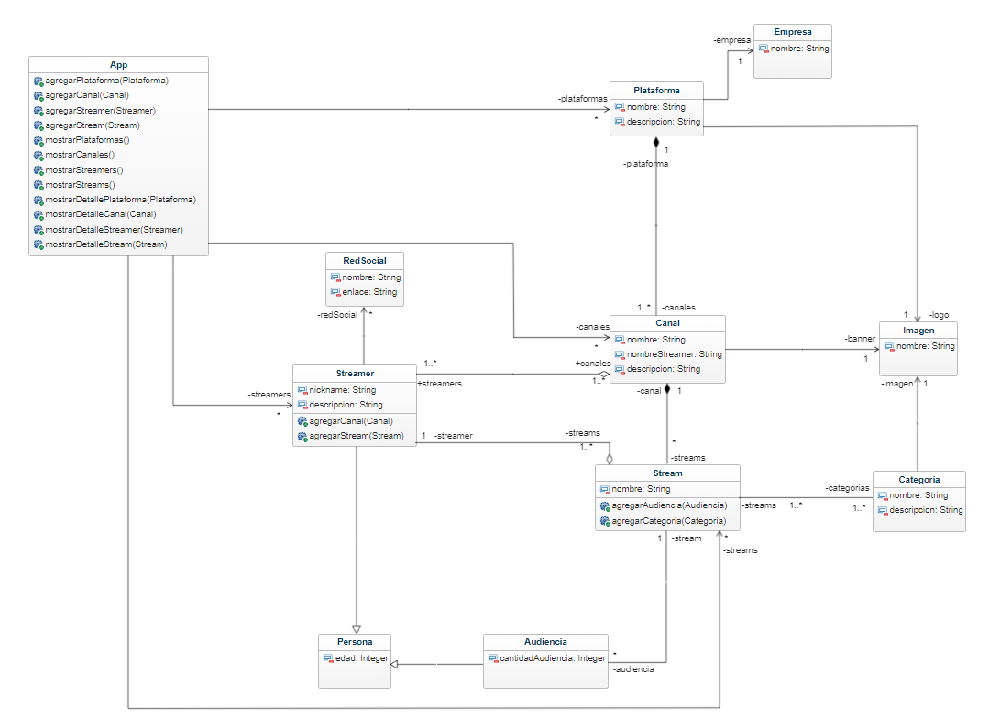

<h1 align="center">Plataforma de Streaming</h1>

Descubre y explora una amplia variedad de canales de streaming de diferentes plataformas, ¡todo en un solo lugar!

  

## Glosario de Términos

### Entidades

1. **Plataforma:** Representa una plataforma de transmisión de streaming. Contiene los siguientes atributos:

   - Nombre: Nombre de la plataforma.
   - Logo: Logo de la plataforma.
   - Descripción: Descripción de la plataforma.
   - Empresa Patrocinadora: Empresa que respalda la plataforma.

2. **Canal:** Representa un canal de transmisión en una plataforma de streaming. Contiene los siguientes atributos:

   - Nombre: Nombre del canal.
   - Banner: Imagen o banner del canal.
   - Streamer Asociado: Nombre del streamer vinculado al canal.
   - Descripción Detallada: Detalles extensos del canal.

3. **Streamer:** Representa un creador de contenido, es decir, una persona que realiza transmisiones en los canales de streaming. Contiene los siguientes atributos:

   - Alias: Nombre de usuario del streamer.
   - Descripción: Descripción del streamer.

4. **Stream:** Representa una transmisión realizada por un streamer en un canal de streaming.

   - Nombre: Nombre del stream.

5. **Categoría:** Describe las temáticas y actividades de un stream. Contiene los siguientes atributos:

   - Nombre: Nombre de la categoría.
   - Descripción: Descripción de la categoría.
   - Imagen: Imagen representativa de la categoría.

6. **Red Social:** Se relaciona con un streamer y muestra sus perfiles en redes sociales. Contiene los siguientes atributos:

   - Nombre: Nombre de la red social.
   - Enlace: URL del perfil del streamer en la red social.

7. **Empresa:** Representa a una empresa que patrocina una plataforma de streaming.

   - Nombre: Nombre de la empresa.

8. **Audiencia:** Representa la cantidad de espectadores en un stream.

   - Cantidad: Cantidad de espectadores en el stream.

9. **Imagen:** Contiene atributos de una imagen, banner o logo.

   - Nombre: Nombre de la imagen.

10. **Persona:** Representa a un individuo.

   - Edad: Edad de la persona.

### Relaciones

- **`Plataforma - Empresa`:** Una plataforma es patrocinada por una empresa, pero no al revés. (Relación "uno" a "varios")

- `Plataforma - Canal:` Varios canales pueden pertenecer a una plataforma, pero cada canal solo pertenece a una plataforma. (Relación "uno" a "varios")

- `Imagen - Plataforma, Canal y Categoría:` Una imagen es accesible por una plataforma, un canal o una categoría, pero no al revés. (Relación "uno" a "varios")

- `Streamer - Red Social:` Un streamer puede tener múltiples redes sociales, pero no se puede navegar directamente de las redes sociales al streamer. (Relación "uno" a "varios")

- `Canal - Streamer:` Un canal puede tener varios streamers y un streamer puede estar en varios canales. (Relación "varios" a "varios")

- `Streamer - Stream:` Un streamer puede realizar varias transmisiones y un stream está asociado a un único streamer. (Relación "uno" a "varios")

- `Stream - Categoría:` Un stream puede tener múltiples categorías y una categoría puede estar en varios streams. (Relación "varios" a "varios")

- `Stream - Canal:` Un canal puede contener varios streams y un stream pertenece a un único canal. (Relación "uno" a "varios")

- `Stream - Audiencia:` Un stream puede tener varios espectadores y una audiencia solo pertenece a un stream. (Relación "uno" a "varios")

- `Persona - Streamer:` Un streamer hereda atributos de una persona.

- `Persona - Audiencia:` La audiencia hereda atributos de una persona.
